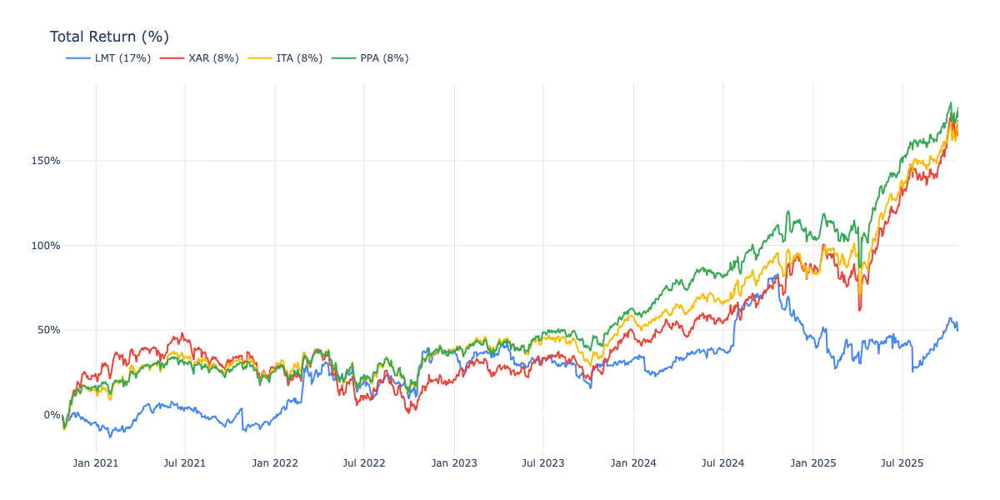

# ETF/Stock Portfolio Analyzer

Analyzes portfolio returns and composition by fetching historical price data and breaking down ETF holdings into individual stock positions.

## Example Output



```
TOP HOLDINGS BY COMPOSITION
============================================================
Ticker         Composition
------------------------------------------------------------
LMT                  18.22%
GE                    2.33%
RTX                   2.13%
...
```
(Holdings are sorted by composition % in descending order)


## Features

- Load portfolio allocations from CSV
- Fetch historical price data using Yahoo Finance
- Calculate and visualize total returns over time
- Decompose ETFs into underlying holdings
- Show aggregated composition across all positions
- Cache ETF holdings data for faster subsequent runs
- Interactive Plotly charts

## Requirements

- Python 3.10+
- uv or pip for dependency management

## Installation

```bash
uv sync
```

Or with pip:

```bash
pip install pandas plotly yfinance
```

## Usage

### Basic Usage

```bash
python analyzer.py
```

This will:
1. Read `portfolio.csv` from the current directory
2. Fetch 5 years of historical data
3. Calculate returns and composition
4. Generate `portfolio_analysis.html` and open it in your browser

### Portfolio CSV Format

Create a `portfolio.csv` file with two columns:

```csv
ticker,allocation
LMT,17
XAR,8
ITA,8
PPA,8
```

- `ticker`: Stock or ETF ticker symbol
- `allocation`: Percentage allocation (should sum to 100)

### Command Line Options

```bash
# Use a different portfolio file
python analyzer.py --portfolio my_portfolio.csv

# Change time period
python analyzer.py --period 1y

# Ignore cached ETF holdings
python analyzer.py --no-cache

# Custom output file
python analyzer.py --output results.html
```

Available periods: `1mo`, `3mo`, `6mo`, `1y`, `2y`, `5y`, `10y`, `max`

## How It Works

1. **Load Portfolio**: Reads ticker symbols and allocations from CSV
2. **Fetch Price Data**: Downloads historical prices from Yahoo Finance
3. **Calculate Returns**: Computes percentage returns normalized to start date
4. **Decompose ETFs**: Fetches top holdings for ETF tickers and calculates weighted exposure
5. **Aggregate Composition**: Combines direct stock holdings with ETF underlying positions
6. **Visualize**: Generates interactive chart showing returns over time

## Caching

ETF holdings data is cached in the `cache/` directory to avoid repeated API calls. Use `--no-cache` to force refresh.

## Output

- **Console**: Top 20 holdings by composition percentage
- **HTML Chart**: Interactive time series of returns for each position